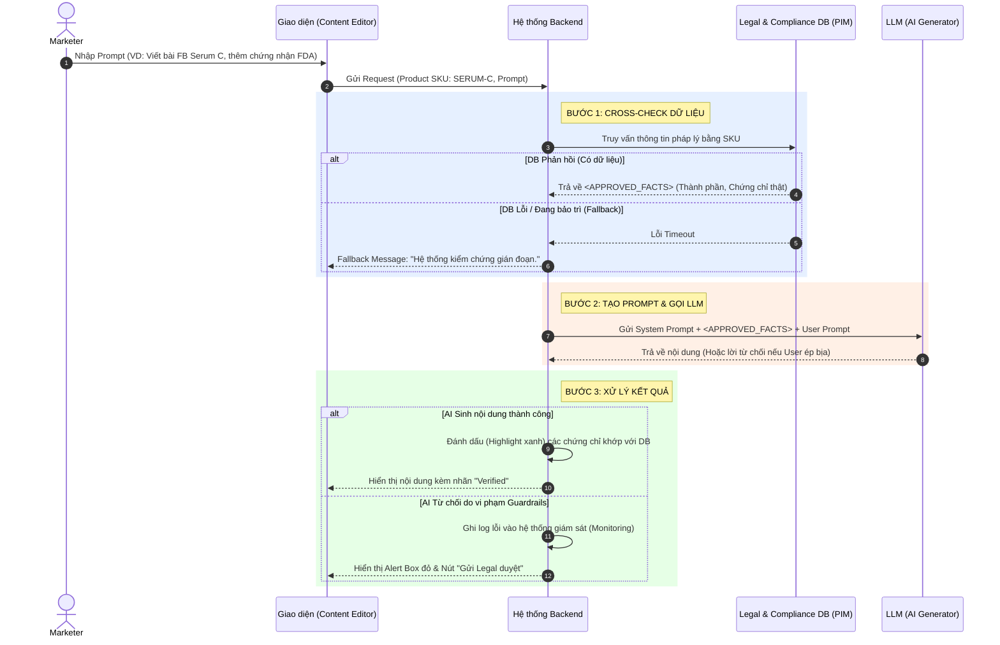

# demo.md — Sơ đồ Kiến trúc Dữ liệu (RAG/API Layer)

Sơ đồ Mermaid dưới đây mô tả luồng dữ liệu của hệ thống, minh họa cách Lớp Kiến trúc chặn đứng nguy cơ AI bịa chứng chỉ (T-01) bằng cách cung cấp "Ground Truth" trước khi gọi LLM.

## Sơ đồ luồng xử lý (Data Flow)

### Giải thích các cơ chế phòng vệ trong Kiến trúc:
1. **Ngăn chặn từ đầu (Prevention)**: LLM không bao giờ phải "đoán" chứng chỉ vì nó được nạp sẵn `<APPROVED_FACTS>` ở Bước 2.
2. **Kiểm tra chéo (Detection)**: Backend kiểm tra lại nội dung LLM sinh ra ở Bước 3. Bất kỳ chứng chỉ nào không nằm trong tập hợp do DB trả về sẽ bị đánh dấu Vàng (Unverified) hoặc AI tự động chặn.
3. **Giám sát (Logging)**: Các trường hợp AI phải từ chối do Marketer ép buộc sẽ được ghi Log lại để phân tích hành vi "lách luật" của người dùng nội bộ, từ đó có kế hoạch training cho nhân viên Marketing.
